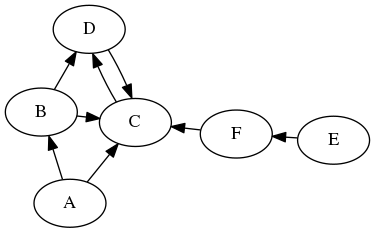

# Algoritmos de inteligencia artificial


#### Búsqueda primero en amplitud (BFS Breadth First Search)

La búsqueda primero en amplitud usa una lista FIFO, una vez modelado el problema como árbol se siguen los siguientes pasos:

- Se expande el nodo raíz 
- Luego se expanden los nodos hijos
- Luego los hijos de los hijos hasta encontrar la solución.

#### Búsqueda primero en profundidad (DFS Depth First Search) 

La búsqueda primero en profundidad usa un lista LIFO, después de modelar el problema como árbol:

- Se expande el nodo raíz 
- Luego se expande uno de los hijos 
- Luego se expanden los hijos del hijo anterior etc.
- Si no es solución se retrocede y se prueba el siguiente hijo.

### Dibujando grafos en python

Para dibujar el grafo se utiliza la librería [pygraphviz](https://pygraphviz.github.io/documentation/pygraphviz-1.3rc1/install.html), que se puede instalar usando el comando: 

```
pip install pygraphviz
```

El grafo se puede definir como un diccionario de python así:

```python
graph = {'A': ['B', 'C'],
         'B': ['C', 'D'],
         'C': ['D'],
         'D': ['C'],
         'E': ['F'],
         'F': ['C']}
```

